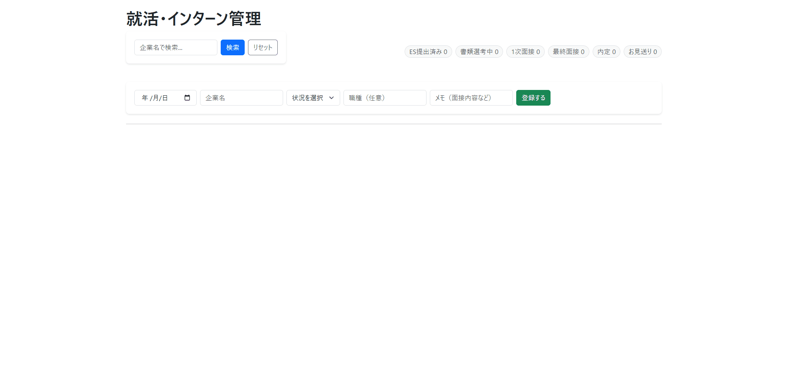

#就活管理アプリ

# 就職活動・インターンシップ選考管理アプリ

## 🚀 デプロイ先
[アプリを開く（Render）]https://job-management-app-womb.onrender.com
※本アプリケーションはRailwayを利用してデプロイまで完了しましたが、現在はインフラ環境の移行（または無料枠の終了）に伴い、一時的に公開を停止しています。動作の様子は以下の動画をご覧ください。

就職活動・インターンシップ選考管理アプリ
概要
自身の就職活動やインターンシップの選考状況を一元管理し、可視化するためのWebアプリケーションです。

開発背景・目的
複数の企業への応募が進む中で、選考フェーズや締切日の管理が複雑化したことを課題に感じ、「自分が必要な情報を一目で把握できるツール」を目指して開発しました。
既存のツールを利用するだけでなく、自ら課題を解決するためのシステムを構築することで、実務に近い開発経験を積むことを目的としています。

使用技術
バックエンド: Java (Spring Boot)

フロントエンド: HTML5, CSS3

データベース: MySQL (Railway上にデプロイ)

インフラ/ホスティング: Railway

ツール: VS Code, Git, GitHub

主な機能
応募ステータス管理: 選考中、書類通過、面接予定などの状態を一覧で管理。

期日管理: 提出期限や面接日程の視認性を向上。

メモ機能: 企業ごとの特徴や面接での振り返りを蓄積。

こだわったポイント
自力での問題解決: 学習の過程で発生したエラー（Gitの競合やDB接続設定など）に対し、公式ドキュメントやデバッグツールを活用して解決するプロセスを重視しました。

クラウド環境へのデプロイ: ローカル環境で完結させず、RailwayとGitHubを連携させ、実際の運用環境を意識したデータベース設計とデプロイを行いました。

今後の展望
データの永続化をより強固にし、分析機能（選考通過率の可視化など）の追加。

UI/UXの改善による操作性の向上。

エンジニア様からのフィードバックを受けて、Service層の導入やUIの改善（視認性向上）を行いました！！
現在もフィードバックを反映中！！
